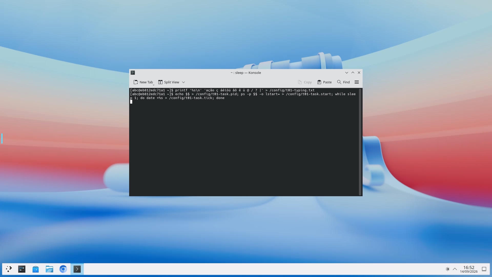

# T01 - desktop local no Windows

Validação de 2026-09-14. Escopo: [T01 / issue #2](https://github.com/manoelcalixto/webtop-arch-kde-workstation/issues/2), a partir do checkpoint Git `61a50a5ac9e5f68d039297b62c99b6c23a2a6844`. Não representa a aceitação dos aplicativos e operações dos tickets posteriores.

A evidência de DEC-036 nesta etapa cobre somente a interface CMD entregue por T01. Diagnóstico completo, backup, recuperação e atualizações continuam pendentes nos respectivos tickets; a aceitação de todos esses comandos pelo CMD pertence a T12/T13. A cobertura registrada não declara essas operações futuras implementadas ou testadas.

## Plataforma e imagem

- Dell Latitude 5450, Intel Core Ultra 7 165U, 12 cores / 14 processadores lógicos, 33.777.467.392 bytes de RAM física.
- Windows, Docker Desktop 4.90.0, engine 29.7.2, `desktop-linux`, kernel `7.0.12-linuxkit`, linux/amd64.
- VMM: `UseLibkrun=true` na configuração e encaminhamento ativo `com.docker.backend.exe.sailorforward` para o endpoint de teste nos logs do backend. Esses sinais identificam o ensaio local; não são evidência Hyper-V.
- VM atual: 4.096 MiB configurados, 3.972 MiB reportados pelo engine e 14 CPUs. Workstation do teste gráfico: limite de 2.560 MiB / 2 CPUs, tela 1920 x 1080, codificação por CPU a 30 fps. A VM não foi reconfigurada; o perfil final de 8 GiB / 6 CPUs e as medições Salesforce pertencem a T12.
- Upstream consumido: `lscr.io/linuxserver/webtop:arch-kde@sha256:ed197a60c161b5d45a0d0137a5c47ecd136964c57791bf3151d01ad41ac6b988`.
- Candidata local: `electivus/webtop-arch-kde-base:t01`, versão `2026.09.14-t01-cert`, identificador local `sha256:16b2f9d00c47654555528a6bddf74acbcd1e0915f8f7d7133a2cb2eddfbd4ec9`. Construída com as correções de certificados ainda na árvore de trabalho sobre `9db9081553455ceab4f4b73c187b0b7a26b3f7db`; não foi publicada.

## Resultados observados

| Critério T01 | Evidência |
| --- | --- |
| Imagem Arch/KDE amd64 | Build pelo Dockerfile fixado; processo Plasma ativo e desktop renderizado. |
| Instalação e operação Windows | `setup.cmd` extraiu os comandos da imagem. `install`, `start`, `status`, `stop`, `certificate`, `trust` e `untrust` foram exercitados via `cmd.exe /d /s /c`, inclusive com caminhos de executável e perfil contendo espaços. `start` reutilizou o mesmo ID após `stop`. |
| Atalho | `Start Workstation.lnk` criado pela API nativa do Windows e executado pela Shell, apontando diretamente para o executável copiado dentro do perfil. O container descartável passou de ausente para saudável. |
| HTTPS local e entrada direta | Porta publicada unicamente em `127.0.0.1`; HTTP nessa porta retorna 400; HTTPS com confiança da instalação retorna 200 sem autenticação adicional. Browser abriu sem exceção de certificado. |
| Idioma, formatos e teclado | Ambiente do processo `plasmashell`: `LANG=en_US.UTF-8`, `LANGUAGE=en_US`, categorias regionais `pt_BR.UTF-8`, `TZ=America/Bahia`. XKB: modelo `abnt2`, layout `br`. Data UTC-03 e interface inglesa vistas na captura. |
| Acentos e símbolos | Transporte pelo browser recebeu `ação ç áéíóú ãõ ê ü @ / ? \|`. Separadamente, `keyboard-abnt2.py` enviou códigos físicos X11, teclas mortas e modificadores, sem fornecer caracteres Unicode compostos; recebeu `á ã ç ê ü @ / ? \|`. O teclado físico Windows do destino ainda precisa do ensaio T12. |
| Continuidade da sessão | A aba foi fechada e outra abriu o mesmo endpoint. PID 1245 e instante de início do terminal permaneceram iguais; a tarefa avançou de `1789415573` para `1789415575` após a reconexão. |
| Isolamento dos testes | `test_commands.py` recusou container e volume sem o identificador da instalação e confirmou que seus estados não foram alterados. Fixtures usam nomes próprios gerados por GUID. |
| Confiança reversível | `trust` permitiu HTTPS com um contexto TLS novo e verificação ativa; `untrust` removeu o certificado de teste do armazenamento físico `CurrentUser/Root`, e nova consulta confirmou sua ausência. A remoção e sua repetição passaram com o container removido, sem Docker no PATH e com um certificado vencido no cache público. |
| Renovação de certificado | O teste reduziu a validade para um dia mantendo o marcador existente; após parar e iniciar, o certificado tinha outra impressão digital e mais de um ano de validade. A cópia pública anterior permaneceu no perfil para remoção posterior da confiança. |
| Ausência de PowerShell no produto | Os scripts PowerShell foram removidos. `workstation.cmd` chama `workstation.exe`; o executável chama o Docker CLI e APIs nativas da Shell/CryptoAPI. O compilador Go roda durante o build Docker. Nenhum SDK ou interpretador adicional é exigido no destino. |



## Repetição

```bat
docker build --file images/base/Dockerfile --target commands-export --output type=local,dest=.local/cli .
docker build --file images/base/Dockerfile --build-arg VERSION=2026.09.14-t01-cert --tag electivus/webtop-arch-kde-base:t01 .
python tests\test_commands.py
python tests\browser_acceptance.py
```

Os três casos de `test_commands.py` passaram; o ensaio de navegador passou e a captura foi inspecionada visualmente. Os relatórios brutos de ciclo e navegador ficam no perfil de teste em `.local/`; as capturas também ficam nesse diretório ignorado. ShellCheck e shfmt verificam os scripts Linux; o build exige gofmt e go vet para Linux e Windows e compila os dois executáveis. O workflow `Checks` repete o build, o ciclo e o isolamento em Linux no GitHub; a prova específica Windows/VMM é este ensaio local.

O Windows apresentou confirmações ao adicionar e remover certificados. A pedido do usuário, os testes ocultam e aceitam automaticamente somente o diálogo cuja impressão digital corresponde ao certificado descartável daquela instalação; a repetição do caso Windows concluiu sem intervenção do operador. O produto mantém a confirmação do Windows e o procedimento consta no README. A API usa o armazenamento físico do usuário, evitando tratar raízes herdadas como certificados próprios; referência: [CertOpenStore da Microsoft](https://learn.microsoft.com/en-us/windows/win32/api/wincrypt/nf-wincrypt-certopenstore).

Para o destino: CMD disponível, Docker Desktop já configurado com containers Linux via Hyper-V, contexto local, capacidade disponível e permissão para executar `workstation.exe` e confiar no certificado de `localhost`. Os comandos não executam PowerShell, não instalam WSL, não habilitam virtualização e não modificam o backend. A execução real em Hyper-V permanece pendente e o roteiro executável completo será entregue em T12, conforme DEC-030.
